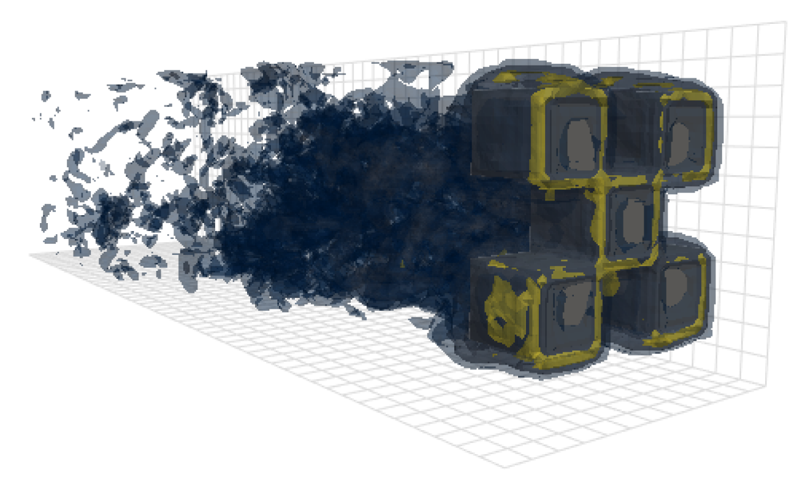
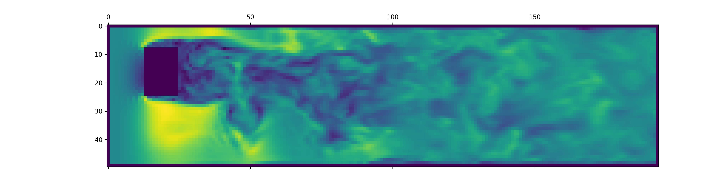

# From Zero to Turbulence: Generative Modeling for 3D Flow Simulation

Marten Lienen, David Lüdke, Jan Hansen-Palmus, Stephan Günnemann



This repository contains the code used to produce the results in our paper: [openreview](https://openreview.net/forum?id=ZhlwoC1XaN), [arxiv](https://arxiv.org/abs/2306.01776).

Besides the model, data loading and training code, this repository also contains code to configure and run OpenFOAM and postprocess its outputs. These tools could be an immensely useful starting point for other researchers in the field. In particular, there is
- a [lark](https://github.com/lark-parser/lark) [grammar for the OpenFOAM configuration format](./turbdiff/openfoam.lark),
- a [python module](./turbdiff/openfoam.py) using this grammar to load, edit and save these configuration files,
- a script to [generate new OpenFOAM cases](./scripts/les-case.py) from a template,
- a script to [generate regular meshes with arbitrary axis-aligned shapes cut out](./scripts/channel-3d.py),
- a script to [run simulations on a SLURM cluster](./scripts/solve-slurm.py) in a docker container via [udocker](https://github.com/indigo-dc/udocker),
- a script to [convert OpenFOAM outputs into much more performant HDF5 files](./scripts/foam2h5.py),
- and a script to [precompute an embedding of the sparse 3D data](./scripts/grid-embedding.py) into dense 3D tensors with padding layers to encode boundary information.
Our [data loader](./turbdiff/data/ofles.py) lets you load all this information into easily digestible data classes. To get started right away, copy and paste the 20 line snippet of code [further below](#loading-the-dataset-for-your-own-project) that loads the data into easy-to-work-with matrices.

## Installation

```sh
# Clone the repository
git clone https://github.com/martenlienen/generative-turbulence.git

# Change into the repository
cd generative-turbulence

# Install package editably with dependencies
pip install -e .

# If you need a specific pytorch version, e.g. CPU-only or an older CUDA version, check
#
#     https://pytorch.org/get-started/locally/
#
# and run, for example,
#
# pip install torch --extra-index-url https://download.pytorch.org/whl/cu117
#
# before installing this package.
```

Alternatively, you can use [pixi](https://pixi.sh) to quickly set up a working environment.
After installing it with `curl -fsSL https://pixi.sh/install.sh | bash`, install and activate the environment at the same time with `pixi shell`.

## Dataset

The shapes dataset is hosted at [TUM university library](https://mediatum.ub.tum.de/1737748). To download it, either follow the instructions on their page or execute the following steps. First, download the files.
```sh
# Download all archives to data/shapes/download
scripts/download-dataset.sh
```
Note, that this can take a long time as the processed data is roughly 2TB. The script uses `rsync`, so you can resume partial downloads. If you also want to download the raw OpenFOAM case data, run instead
```sh
scripts/download-dataset.sh --with-raw
```
After downloading the invididual archives, you need to extract the files. The following script does so for you
```sh
scripts/extract-dataset.sh
```
Afterwards, you can start training the model as described below.

### Loading the dataset for your own project

The following snippet loads data from any of the `data.h5` files in the dataset for you to explore and experiment with.

```python
import numpy as np
import h5py as h5

def load_data(path, idx, features = ["u", "p"]):
    """Load data from a data.h5 file into an easily digestible matrix format.

    Arguments
    ---------
    path
        Path to a data.h5 file in the `shapes` dataset
    idx
        Index or indices of sample to load. Can be a number, list, boolean mask or a slice.
    features
        Features to load. By default loads only velocity and pressure but you can also
        access the LES specific k and nut variables.

    Returns
    -------
    t: np.ndarray of shape T
        Time steps of the loaded data frames
    data_3d: np.ndarray of shape T x W x H x D x F
        3D data with all features concatenated in the order that they are requested, i.e.
        in the default case the first 3 features will be the velocity vector and the fourth
        will be the pressure
    inside_mask: np.ndarray of shape W x H x D
        Boolean mask that marks the inside cells of the domain, i.e. cells that are not part
        of walls, inlets or outlets
    boundary_masks: dict of str to nd.ndarray of shape W x H x D
        Masks that mark cells belonging to each type of boundary
    boundary_values: dict[str, dict[str, np.ndarray]]
        Prescribed values for variables and boundaries with Dirichlet boundary conditions
    """

    with h5.File(path, mode="r") as f:
        t = np.array(f["data/times"])

        cell_data = np.concatenate([np.atleast_3d(f["data"][name][idx]) for name in features], axis=-1)
        padded_cell_counts = np.array(f["grid/cell_counts"])
        cell_idx = np.array(f["grid/cell_idx"])

        n_steps, n_features = cell_data.shape[0], cell_data.shape[-1]
        data_3d = np.zeros((n_steps, *padded_cell_counts, n_features))
        data_3d.reshape((n_steps, -1, n_features))[:, cell_idx] = cell_data

        inside_mask = np.zeros(padded_cell_counts, dtype=bool)
        inside_mask.reshape(-1)[cell_idx] = 1

        boundary_masks = {name: np.zeros(padded_cell_counts, dtype=bool) for name in f["grid/boundaries"].keys()}
        for name, mask in boundary_masks.items():
            mask.reshape(-1)[np.array(f["grid/boundaries"][name])] = 1

        boundary_values = {
            ft: {
                name: np.atleast_1d(desc["value"])
                for name, desc in f["boundary-conditions"][ft].items()
                if desc.attrs["type"] == "fixed-value"
            }
            for ft in features
        }

    return t, data_3d, inside_mask, boundary_masks, boundary_values
```

You can use it like

```python
from matplotlib.pyplot import matshow

path = "data/shapes/data/2x2-large/data.h5"
t, data_3d, inside_mask, boundary_masks, boundary_values = load_data(path, [50, 300])

matshow(np.linalg.norm(data_3d[-1, :, :, 20, :3], axis=-1).T)
```



The `data.h5` files contain more information than this snippet loads. To explore what else is available, poke around in our [data loader](./turbdiff/data/ofles.py).

### Data generation with OpenFOAM in docker

To generate data for new OpenFOAM simulations, first make sure that you have installed the extra dependencies and have [`just`](https://just.systems/) available:
```sh
pip install -e ".[data]"
```
If you don't want to use `just`, you can also read the [`justfile`](./justfile) and run the commands yourself.

Begin by creating a docker container with OpenFOAM installed:
```sh
just of-docker
```

Now generate a bunch of new cases. For example, the following sets up all the OpenFOAM cases (simulations) from our dataset:
```sh
./scripts/generate-shapes.py data/shapes
```
Of course, you can adapt the script to create other shapes or completely new datasets.

Now you can solve the case (run the simulation) with OpenFOAM locally
```sh
just of-solve path/to/case
```
or submit a whole bunch of them to your own SLURM cluster:
```sh
./scripts/solve-slurm.py data/shapes/data/*/case
```

Afterwards, apply the postprocessing, e.g. the HDF5 conversion, to each simulation, for example
```sh
just postprocess data/shapes/data/2x2
```

Finally, compute the training set statistics for feature normalization:
```sh
./scripts/dataset-stats.py data/shapes
```

## Training

To start a training, call `train.py` with the your settings, for example
```sh
./train.py data.batch_size=128
```
The training script uses [hydra](https://hydra.cc) for configuration, so check out the files in the `config` directory, to learn about all available settings.

To re-run the experiments from the paper, execute
```sh
./train.py -cn shapes_experiment -m
```
which starts training with the settings in [`config/shapes_experiment.yaml`](./config/shapes_experiment.yaml). If you don't have a SLURM cluster available, remove the settings related to `launcher`.

## Pretrained Checkpoint

You can download a pretrained checkpoint from [zenodo](https://zenodo.org/records/14892192/files/turbdiff.ckpt) with `curl -O https://zenodo.org/records/14892192/files/turbdiff.ckpt`.
To generate samples from it or any of your own checkpoints, run
```sh
scripts/eval_ckpt.py turbdiff.ckpt samples.h5 data.batch_size=256
```
The script lets you override any configuration values such as `data.batch_size` in the example above.
`eval_ckpt.py` also serves as a great starting point for other types of evaluations.

## Citation

If you build upon this work, please cite our paper as follows.

```
@inproceedings{lienen2024zero,
  title = {From {{Zero}} to {{Turbulence}}: {{Generative Modeling}} for {{3D Flow Simulation}}},
  author = {Lienen, Marten and L{\"u}dke, David and {Hansen-Palmus}, Jan and G{\"u}nnemann, Stephan},
  booktitle = {International {{Conference}} on {{Learning Representations}}},
  year = {2024},
}
```
